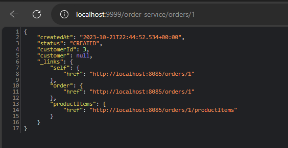
<h4>Orders</h4>
using order rest controller 

Vault is a tool used for managing and securing sensitive information, such as passwords, API keys, certificates, and other secrets, in a centralized and highly secure manner. It provides a way to store, access, and control access to these secrets, ensuring that they are kept confidential and protected from unauthorized access.

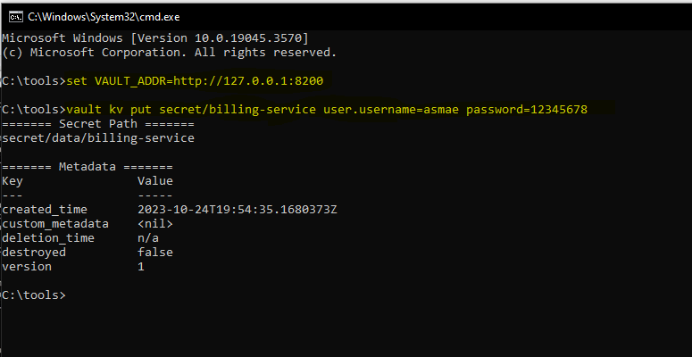
Vault interface 
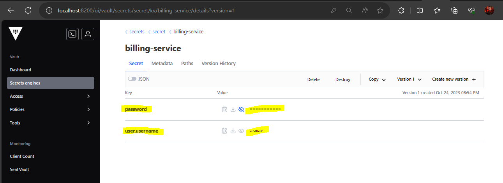

first i try not to add opt variable in vault, and it's null as we can see below

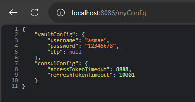

add the opt variable 

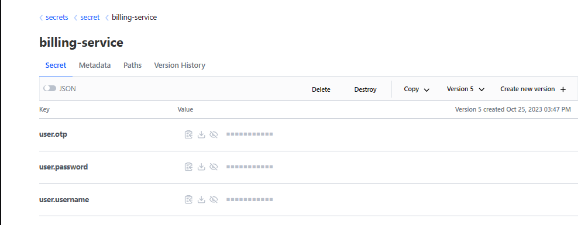

Refresh request

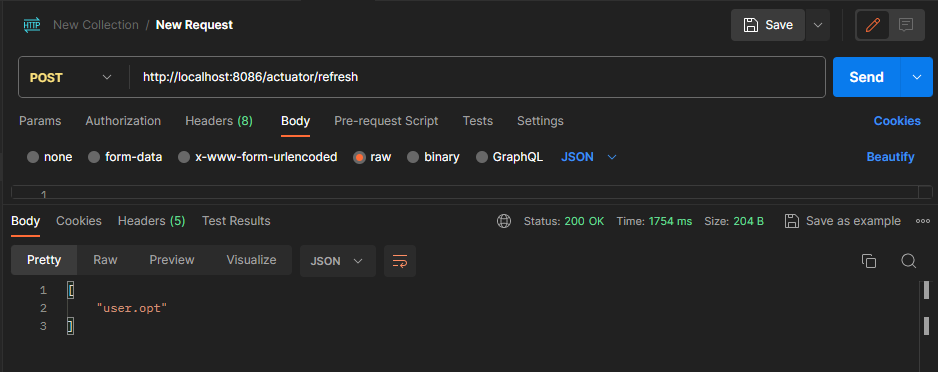

the result

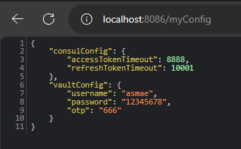
<h3>Angular</h3>

Product list

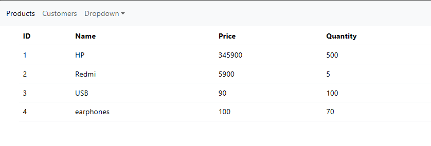

Customer list

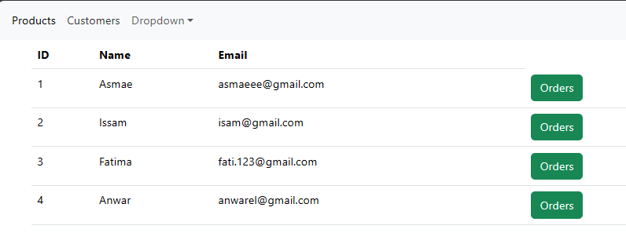

Get orders by customer id

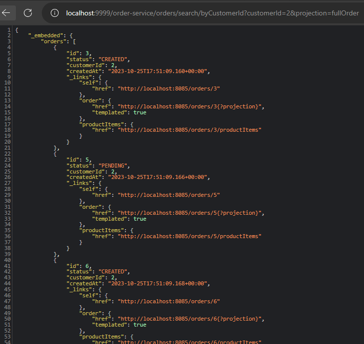
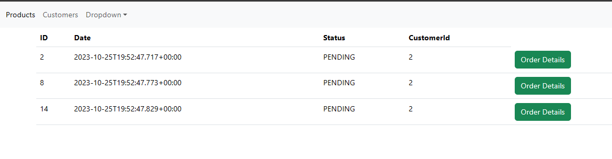

Get order details

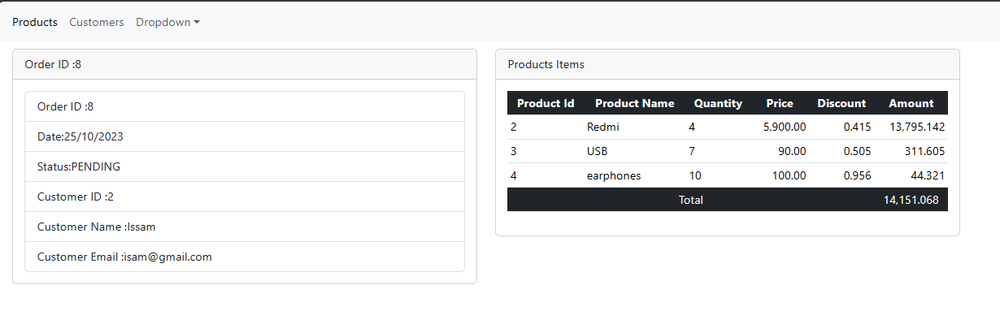
